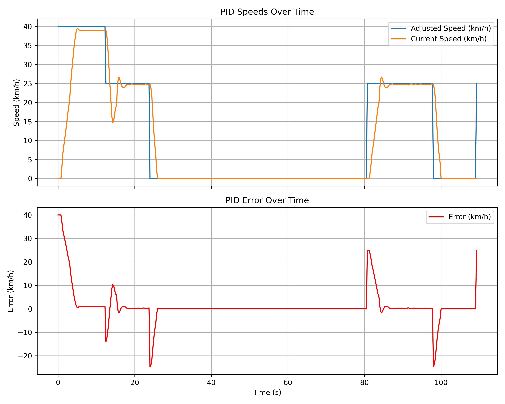
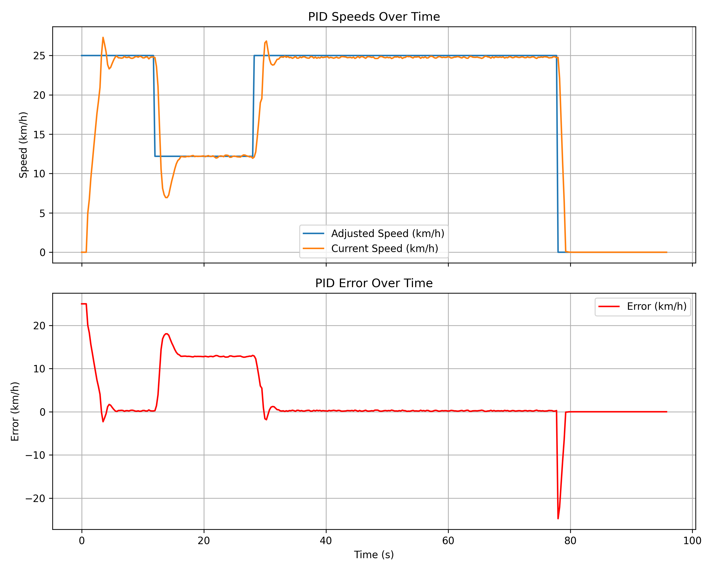
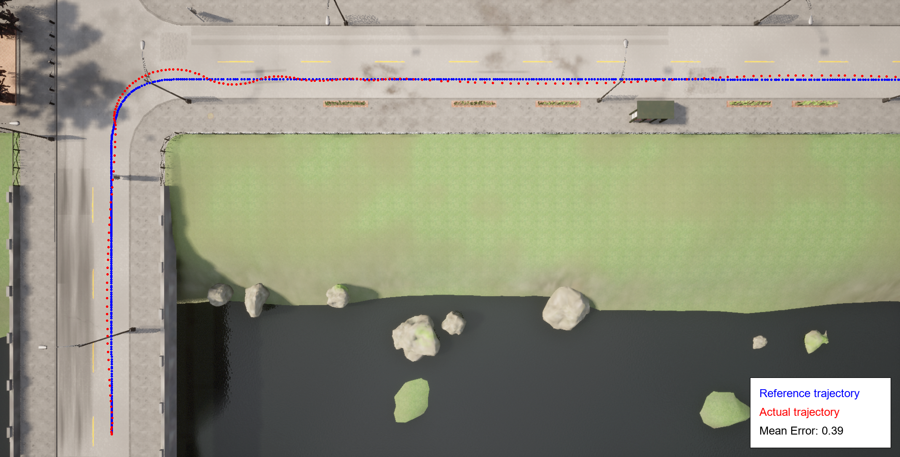

# Carla-Adaptive-Speed-Control

A Python-based autonomous vehicle control system using CARLA simulator with adaptive speed control, traffic sign detection, and trajectory following capabilities.

## Features
- Real-time traffic sign and traffic light detection using YOLOv8
- PID-based speed controller
- Stanley controller for lateral control
- Adaptive speed adjustment based on road conditions
- Data logging and visualization tools
- Support for multiple control scenarios

## Requirements
```
carla==0.9.15 
numpy 
pandas 
matplotlib 
pillow 
scipy 
opencv-python 
ultralytics
```
## Project Structure
📂 controllers - Control algorithms implementation 
-    pid.py - PID controller for longitudinal control 
-    stanley.py - Stanley controller for lateral control

📂 detector - Traffic sign detection system 
-    detector.py - YOLOv8-based object detection 
-    train.py - Training script for the detector

📂 environment - CARLA simulator interface 
-    carla.py - CARLA setup and utilities 
-    data_logger.py - Logging system for trajectory and performance data

📂 scripts - Utility scripts 
-    plot_pid.py - Visualize PID controller performance 
-    plot_trajectory.py - Visualize vehicle trajectories 
-    save_top_view.py - Save top-view images from CARLA


## Installation
1. Install the required dependencies:
   ```bash
   pip install -r requirements.txt

2. Install CARLA simulator (version 0.9.15)

## Usage
1. Start the CARLA simulator
2. Run the main script:
    ```bash
    python run.py
    ```

## Data Visualization
The system includes several visualization tools:

-   PID controller performance plots
-   Trajectory visualization
-   Real-time detection visualization

## Demo
Here are demo videos showcasing the application in action:

### Straight Navigation Demo
<video width="600" controls>
  <source src="results/straight/straight.mp4" type="video/mp4">
  Your browser does not support the video tag.
</video>



### Curve Navigation Demo
<video width="600" controls>
  <source src="results/curve/curve.mp4" type="video/mp4">
  Your browser does not support the video tag.
</video>





## Creators
-   Pap Bence - VEJP2J
-   Csippán György - XIJHSN